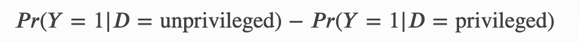

# fairness_analysis_example
Fairness analysis of a dataset using [aif360 Python library](https://pypi.org/project/aif360/).
This example notebook uses a [Kaggle Public Dataset](https://www.kaggle.com/balavashan/students-performance-dataset)

I have used two metrics to analyze dataset fairness:

### Disparate Impact

This metric gives the ratio of the probability of unprivileged group getting a positive outcome versus the privileged group. Here the positive outcome (Y=1) and the selection of privileged group depends on the task and data. According to the explanation given [here](https://docs.aws.amazon.com/sagemaker/latest/dg/clarify-post-training-bias-metric-di.html)

* Values less than 1 indicate that privileged group a has a higher proportion of predicted positive outcomes than unprivileged group. This is referred to as positive bias.
* A value of 1 indicates demographic parity.
* Values greater than 1 indicate that unprivileged group has a higher proportion of predicted positive outcomes than privileged group. This is referred to as negative bias.

The norm for this value should be between 0.8-1.0 for a fair dataset

### Statistical Parity Difference

This measure gives the difference between the probability of unprivileged group getting a positive outcome versus the probability of privileged group getting a positive outcome.

* Values less than 0 indicate that, privileged group has higher proportion of predicted positive outcomes than unprivileged group.
* Value 0 indicates that, there is no difference between two groups
* Value higher than 0 indicates that unprivileged group has higher proportion of predicted positive outcomes than privileged group.
